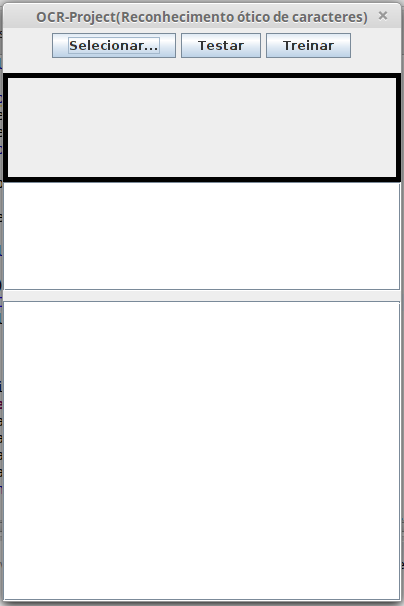
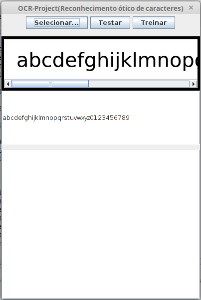
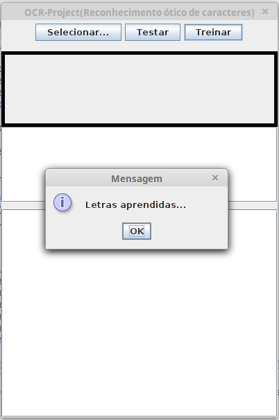
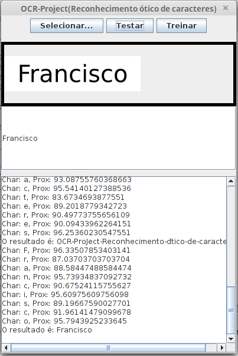
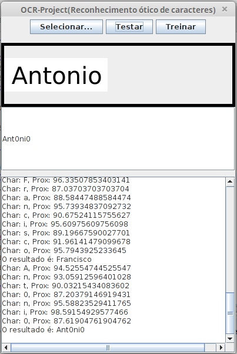
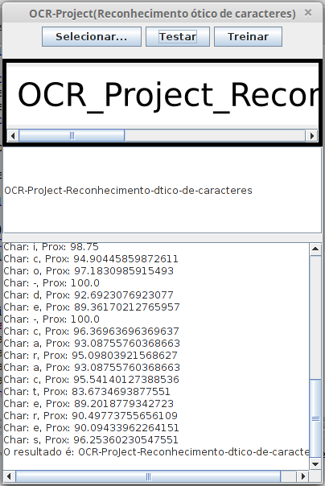

# ocr-project
Implementei e desenvolvi essa aplicação durante meu estudo com processamento de imagens e OCR(Reconhecimento ótico de caracteres).
Por enquanto são reconhecidas apenas palavras isoladas, ainda não sendo possível reconhecer espaços e quebras de linha.

Para executar a aplicação e realizar testes de reconhecimento, basta acessar o diretório exemplo e executar o ocr-project.jar: Esta compilação ja possui um arquivo serializado com dados de treinamento.

O projeto contém um subdiretório com a seguinte estrutura:
* test-resource //Diretório base de recursos.
* -> learn //Subdiretório com imagens a serem usadas no treinamento.
* -> test //Subdiretório com imagens a serem testadas.
* -> data.ser //Dados de treinamento serializados.

## Treinamento de novas letras
Processo de treinamento de novas imagens:

Selecione a imagem por meio do botão Selecionar, digite no campo abaixo o texto correspondente a imagem e pressione o botão treinar para realizar o treinamento inicial, realize esse procedimento para toda e qualquer nova fonte ou estilo de letra que deve ser suportada pelo ocr-project.

## Testando o reconhecimento de letras
Selecione a imagem por meio do botão "Selecionar..." e pressione o botão "Testar" para realizar o reconhecimento do texto na imagem selecionada.

Na caixa de texto logo abaixo da imagem ira aparecer o texto reconhecido e mais abaixo o console com o resultado da análise dos caracteres da imagem.

## Mais exemplos...

## Observações:
É possivel notar a dificuldade no reconhecimento de determinadas letras, como por exemplo O e 0, L e I entre outras que possuem grande semelhança, futuramente planejo aplicar um classificador mais eficiente afim de melhorar os resultados de reconhecimento.
